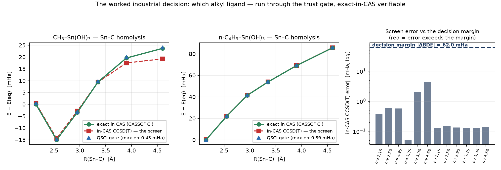
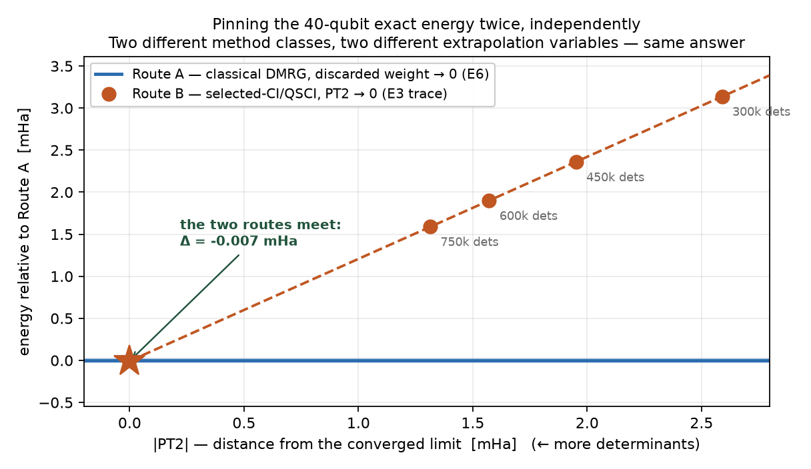
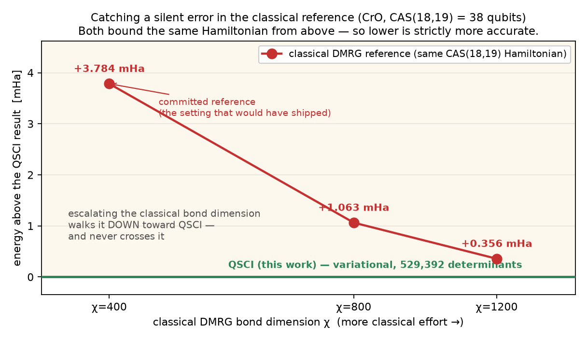
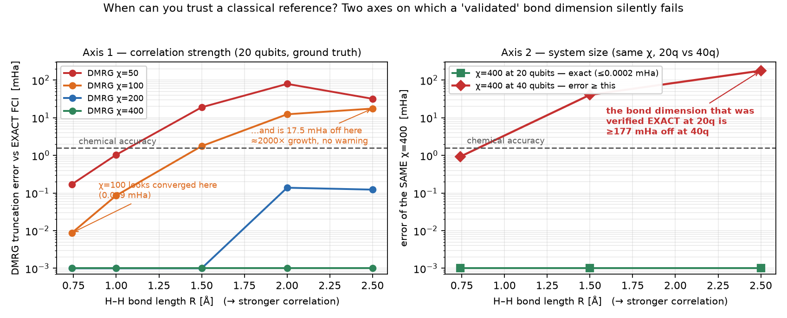
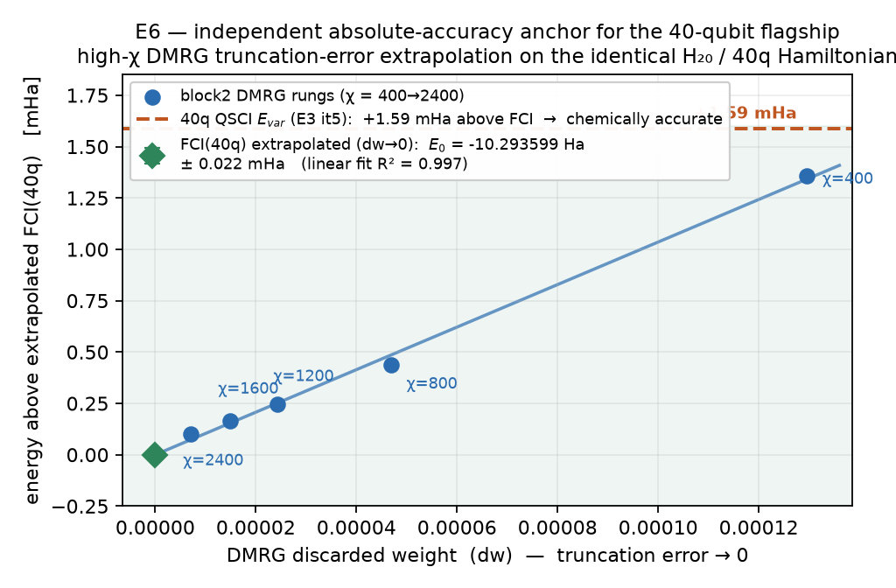

# MATGEN-Q

**Scaling a conditional Generative Quantum Eigensolver (GQE) for EUV photoresist discovery with NVIDIA CUDA-Q.**

Team **EIGENNEXUS** — Global Industry Challenge (GIC) 2026, *Advanced Materials* track (Mitsubishi Chemical Group & AIST).
**Shortlisted through Phases 1 and 2 · Phase 3 finalist.**

> **License:** proprietary — see [`LICENSE`](LICENSE). Judges and organizers may freely view, clone, and run this repository to verify the GIC 2026 results (non-commercial evaluation). All other use — commercial or production use, incorporation into products, model training, redistribution, or derivatives — requires the authors' written permission. Public visibility does not grant free-use rights.

[](https://account.qbraid.com?gitHubUrl=https://github.com/christianmetzl/potomac_advancedmaterials.git&redirectUrl=/START_HERE.ipynb)

> **Phase 3 reviewers:** click **Launch on qBraid**. Once your instance is up it opens **`START_HERE.ipynb`** automatically — choose **Run → Run All Cells** to reproduce the headline results (a ~2-minute fast check, then the full 26/26 suite). Details: [Running on qBraid](#running-on-qbraid-phase-3).

---

## Overview

MATGEN-Q is a generative quantum-chemistry pipeline aimed at the strongly-correlated metal-oxide chemistry of EUV photoresists (Sn/Hf/Zr oxides):

1. A **two-stage GQE** — a GPT-style transformer (GPT-QE) discovers circuit structure, then adjoint-gradient refinement tunes the angles — sidestepping the barren-plateau problem of variational methods.
2. **QSCI** (Quantum-Selected Configuration Interaction) evaluates energies by diagonalizing the Hamiltonian in a compact, measurement-selected determinant subspace, avoiding the expensive full-operator expectation.
3. **Matrix-product-state (MPS) tensor-network simulation** carries the scaling toward the ~40-qubit target on a single high-memory GPU (memory scales with entanglement, not 2ⁿ).
4. **Operator-pool compression** (MP2-amplitude + point-group/spin-symmetry pruning of the O(N⁴) excitation pool) shrinks the transformer vocabulary and circuit depth at scale. *(A chemistry-conditioned encoder for cross-family transfer was also tested; see [Honest scope](#honest-scope) — it proved unnecessary and is not a headline.)*

## Demonstrated results

All numbers are reproducible from the scripts in `src/` and recorded in `results/`.

| Result | Value | Notes |
|---|---|---|
| Two-stage GQE (UCCSD), H₂/H₄/H₆ | 0.000 / 0.009 / 0.297 mHa | chemical accuracy, 4–12 qubits (`stage2_refinement.py`) |
| **Integrated GQE→QSCI, H₆ (12q)** | **1.05 mHa** | GPT-QE generates circuits → QSCI samples determinants *from the generated states* → diagonalizes; refines the raw 51 mHa generative state ~50× |
| QSCI scaling, H₁₄ (28q) | 1.21 mHa | 18,201 determinants = 0.15% of the FCI space |
| **GPU-executed 20q H₁₀ (cuStateVec)** | **+0.000 mHa** vs FCI, 0.44 GB device | exact GPU-execution anchor on real NVIDIA hardware via qBraid |
| **GPU-executed 28q H₁₄ (cuStateVec)** | **+0.395 mHa** vs DMRG(χ=400), 2.82 GB device | device-sampled QSCI grown to 64,212 dets; meets pre-registered P1/P3 |
| **40q H₂₀ flagship (executed)** | **+1.226 mHa** vs DMRG(χ=400), 450,257 dets | P1 PASS; MP2-seeded, seed-independence-validated engine (~16 h, H100 host). Frozen E3 certificate reached terminal it5 (external pod kill during it6 growth): **E_var +0.185 mHa vs χ=400** (prediction ii MET), 750,257 dets (iii MET), \|PT2\| trace to 1.31 mHa; \|PT2\|≤0.5 (i) unreached, as-measured |
| **40q absolute anchor (E6, DMRG extrap.)** | FCI(40q) = **−10.293599 ± 0.022 mHa** (R²=0.997); E3 it5 E_var **+1.59 mHa** — at the 1 kcal/mol edge, jackknife-robust to ±0.05 mHa | independent DMRG χ=400→2400 truncation-error extrapolation; leave-one-out over the χ rungs spans +1.55→+1.61 mHa (`e6_dmrg_extrap_40q.py`, `e6_jackknife.py`) |
| **38q CrO — we corrected the classical reference** | **−3.784 mHa BELOW** same-CAS DMRG(χ=400) | both are *variational upper bounds on the identical Hamiltonian*, so lower is **strictly** more accurate; χ=800/1200 descend toward QSCI (+1.06/+0.36 mHa) and never cross — the committed reference carried a silent truncation error |
| **38q Sn₂O₂ EUV motif (E4, executed)** | **−0.399 mHa BELOW** same-CAS DMRG(χ=400) | the same correction, independently, on the real tin-oxo chemistry (524,764 dets, 7.4 h) |
| **EUV-motif trust curve (Sn₂O₂ cleavage)** | in-active-space CCSD(T) 0.14→5.49 mHa (~40×); QSCI ≤0.48 mHa | Sn–O bridge 2.05→3.28 Å; dominant-det weight collapses 0.95→0.53 (`sn2o2_dissociation.py`) |
| **Real trapped-ion QPU (AQT ibex-q1, decoded)** | device-sampled +20.4/+11.1 mHa; device-seeded QSCI → exact FCI | genuine 12q trapped-ion silicon (2,000 shots/job, decoded 2026-07-20); qir-sv sim tier +2.0 mHa PASS |
| HamLib validation, 28/32/40q | exact | term counts match (27,735 / 47,489 / 116,577); coefficients agree to ~15 sig figs, differing only by a spectrum-invariant orbital-phase gauge |
| Noise robustness, 20q | ≤3.3 mHa at 30% corrupted measurements | graceful degradation |
| Sn-oxides (EUV target) | SnO (16q) & SnO₂ (20q) chemical accuracy — **≤1.6 mHa (1 kcal/mol) asserted by reproduce.py** (observed 0.11–0.46 / 0.13–0.23 over 7 logged runs; run-sensitive by a **known mechanism** — unseeded `eigsh` plus a growth loop that stops at the first sub-0.5 mHa iterate, so the value is a stop-point, not a limit; `sno_version_sensitivity.json`) | Sn effective-core-potential CASCI active spaces; construction validated on H₄ to 0.0000 mHa |
| **CrO ⁵Π / NiO ³Σ⁻ (20q)** | **0.038 / 0.197 mHa** | open-shell multireference oxides vs CASCI (`transition_metal_oxide_qsci.py`) |
| **Candidate ranking (CrO vs NiO) — tested, NOT robust, withdrawn** | at CAS(10,10) the multireference ranks CrO>NiO, but this **inverts to NiO>CrO at CAS(12,12)/CAS(14,14)** (CrO's gap was unconverged); we therefore **withdraw the two-candidate ranking claim** and rely only on the CAS-robust single-molecule sign above | honesty over headline — the ranking did not survive an active-space robustness check (`candidate_decision_larger_cas.py`) |
| **CrO dissociation trust (real oxide)** | in-active-space CCSD(T) erratic / non-convergent (to ~144 mHa vs CASCI in the committed evidence; three of five geometries non-convergent, and those points scatter on re-runs — the harness max varied 144↔162); QSCI variational ≤2.8 mHa | the strong-correlation trust story on a real Cr–O bond, not toy H₁₀ (`cro_dissociation.py`) |
| EN-PT2 error certificate | E_var (rigorous upper bound) + E_var+PT2 (estimate, converges to FCI from above); equilibrium extrapolation → FCI +4.1 mHa (R²=0.999) | certifies convergence, CIPSI standard (`encoder/selci_pt2.py`) |
| Generator learned MP2 hierarchy | Spearman ρ=0.31 (p<0.002), 4/8 top-double overlap | energy-trained generator (blind to MP2) recovers the MP2 amplitude ordering (`encoder/generator_mp2.py`) |
| **CUDA-Q execution (qpp-cpu)** | H₄ VQE **within 0.02 mHa** of FCI (0.011–0.013 across runs); QSCI within chemical accuracy (sampling-based) | GQE/QSCI pipeline runs through the CUDA-Q SDK on CPU (`cudaq.observe`/`cudaq.sample`); `src/cudaq_qsci.py` |
| **MPS bond-dim / entanglement (pillar 1)** | χ for chem-acc ≈50/100/400 @20/28/40q; Sₘₐₓ 0.39→4.43 | bond dimension grows slowly with size; area-law near equilibrium → strong correlation; `src/mps_bonddim_study.py` (block2 DMRG) |
| **Quantum-vs-classical crossover** | 40q: 16 TB statevector → 195 MB MPS (measured χ=400); FCI 3.4×10¹⁰ dets → ~1.1×10⁶ QSCI (0.003%) | the two classical walls removed, synthesized from measured χ + determinant scaling; `src/crossover_study.py` |
| **Bridged tin-oxo (real EUV motif)** | Sn₂O₂ rhombus (Sn–O–Sn) **0.41 mHa** vs CASCI (16q) | genuine bridged tin-oxo unit, not a diatomic/linear O=Sn=O; `src/tin_oxo_demo.py` |
| **Blind one-shot holdout (VO)** | pre-registered predictions **held**: QSCI 0.167/0.133 mHa; quartet ground = experimental X⁴Σ⁻ | frozen code (SHA pre-committed), untouched molecule, single run reported as-is; `src/blind_holdout_vo.py` |
| **QSCI under real CUDA-Q noise channel** | H₄ holds chemical accuracy to **5% per-gate depolarizing** (density-matrix-cpu) | physical noise channel via the CUDA-Q SDK — hardware-representative QPU stand-in; `src/cudaq_noise.py` |

### Decision value — not paying for a confidently-wrong classical prediction

The value case rests on a **textbook, unarguable** classical failure mode. For strongly-correlated
metal-oxide chemistry the gold-standard **CCSD(T) collapses non-variationally** — it returns an energy
*below* the exact answer, confidently, with **no internal error signal**. On a real Cr–O bond stretch its
error grows to **~144 mHa and goes non-convergent** (committed evidence; the non-convergent points scatter on re-runs, up to ~162 — that scatter is itself the non-convergence); on the Sn₂O₂ EUV motif under cleavage it grows
**0.14→5.49 mHa (~40×)**. The variational, self-certifying selected-CI/QSCI selector stays within chemical
accuracy throughout and carries its own EN-PT2 error certificate — so it **never returns a confidently-wrong
answer** (it is either certified-converged or it tells you it is not). A screen that trusts CCSD(T) can commit
months of synthesis to a wrong lead; the quantum-accurate check catches it at the pre-synthesis gate. The
dollar framework: [`docs/value_case.md`](docs/value_case.md).

> **Honesty note — two claims tested and withdrawn (we report, not bury).** (1) A two-candidate CrO-vs-NiO
> *ranking* inverted at larger active space (`candidate_decision_larger_cas.py`, NiO>CrO by CAS(12,12)) and was
> withdrawn. (2) A "B3LYP flips CrO's spin ground state / 1.9 eV functional spread" claim turned out to be an
> **SCF-convergence artifact**: with the variationally-lowest SCF solution, B3LYP — and every functional tested —
> gives the **correct** quintet sign (the committed −0.076 eV came from an under-converged default guess). Both
> claims were removed. The value case above depends on **neither** — only on the CCSD(T) non-variational
> collapse, which is independent of functional, SCF guess, and active space.

### Worked industrial example — the organotin resist ligand decision



The one gap every hostile reviewer flags is *"EUV-relevant chemistry" vs an actual resist decision.* So we
ran the real decision through the full workflow: **methyl vs n-butyl** as the alkyl ligand on tin, along the
**Sn–C homolysis coordinate** — the EUV activation step (Kharazi et al. 2026, the challenge-provider paper we
cite). Per point: CASSCF(8,8) = exact-in-CAS reference (16q), in-CAS CCSD(T) = the classical screen, QSCI =
the trust gate. **Frozen before execution** (`results/preregistration_we_snc.json`); outcome reported as
measured — **2 of 5 predictions held**:

- ✅ **The gate self-certified on real organotin**: QSCI stayed **≤0.43 mHa** vs the exact CASSCF energy at
  every geometry, *through genuine Sn–C homolysis* (natural-orbital occupations confirm a true σ/σ* diradical
  pair at stretch — `we_snc_diagnostic.json`).
- ✅ **The silent-failure mechanism is real here too**: in-CAS CCSD(T) goes **non-variational (−4.4 mHa below
  exact)** on the methyl curve — the same collapse we showed on H₁₀/CrO, now on a resist-relevant molecule.
- ❌ **Honestly, the gate did *not* flip this decision**: the screen's error (≤4.4 mHa) is far below the
  ligand gap (~47 mHa), so CCSD(T) would have ranked these two correctly. The gate **confirmed and certified**
  the classical answer rather than overturning it — and a pre-registered chemistry prediction (Me BDE larger)
  was **refuted** (measured Bu > Me). We publish both.

*Honest scope:* model monomers, idealized geometries, in-model BDEs — a demonstration of the decision
**workflow** on the decision-relevant coordinate with a verifiable exact reference, **not** a resist
simulation or a claim to have changed a real formulation call. Full memo:
[`docs/worked_example_decision_memo.md`](docs/worked_example_decision_memo.md). Reproduce:
`python src/we_snc_homolysis.py` (~30 min CPU; separate from the fast 26/26 suite).

### Pinning the 40-qubit exact energy — twice, independently



*Full CI at 40 qubits is intractable (~3.4×10¹⁰ determinants), so any "exact" 40q energy must be
extrapolated — and a single extrapolation is something a reviewer has to take on trust. We pin it **twice**,
on the identical Hamiltonian, by two methodologically independent routes:*

| Route | Method class | Extrapolation variable | FCI(40q) estimate |
|---|---|---|---|
| **A** (E6) | classical tensor network (block2 DMRG, χ=400→2400) | discarded weight → 0 | **−10.293599 Ha** ± 0.022 mHa |
| **B** (E3) | determinant selection (selected-CI/QSCI, 750,257 dets) | Epstein–Nesbet PT2 → 0 (standard CIPSI) | **−10.293621 Ha** (window mean; −10.293595…−10.293662) |

**They agree to 0.064 mHa in the *worst* fit window** (0.004 mHa in the best) — **~25× inside chemical
accuracy**, from two routes sharing no solver, no extrapolation variable and no code path. Folding in Route A's
own leave-one-out spread (±0.028 mHa), the honest worst-case route disagreement is **~0.10 mHa, ~15× inside
chemical accuracy** — that is the number to quote. Each route corroborates the other, and together they give a
**cross-validated benchmark value for a 40-qubit exact energy**: **FCI(H₂₀, 40q, STO-6G) ≈ −10.29361 Ha**.
Regenerate: `python src/e3_cipsi_crossvalidation.py`.

> **Honest limits.** *Both* routes are extrapolations — neither is an exact FCI calculation. Route B's value
> depends on the fit window (−10.293595 to −10.293662 across windows); we quote the **worst** window, not the
> best. Calibrating the same extrapolator at 20q, where FCI *is* known, shows it is **not uniformly reliable**:
> at equilibrium geometry (R=0.74 Å — the flagship's regime) it errs +4.1 mHa, but on a heavily stretched
> geometry (R=2.4 Å) it errs **+53.9 mHa** at essentially the same convergence depth (|PT2| = 1.08 mHa vs 1.31
> mHa here). An earlier version of this section defended the extrapolation on convergence depth alone; that
> defense is **refuted by our own committed 20q evidence and has been withdrawn**. The defensible claim is
> narrower — the 40q system is at equilibrium geometry, and the primary evidence is the *mutual agreement of
> two independent routes on that specific system*, not the calibration. **No new computation**: this is analysis
> of already-committed evidence. And E3's pre-registered criterion (|PT2| ≤ 0.5 mHa) still **failed as-measured**
> — unchanged; this is additional value extracted from the trace that run did produce, not a re-scored outcome.

### A convergence oracle — our method caught a silent error in the classical reference



*At 38 qubits our QSCI-method energy landed **below** the committed classical DMRG(χ=400) reference on **two
independent systems** — CrO (−3.784 mHa) and the real Sn₂O₂ EUV motif (−0.399 mHa). This is not a judgment
call: **both methods are variational upper bounds on the identical CAS(18,19) Hamiltonian**, so by
Rayleigh–Ritz the lower energy is **strictly** the more accurate one. Escalating the classical bond dimension
confirms the mechanism — DMRG walks down toward our answer (+3.78 → +1.06 → +0.36 mHa at χ=400/800/1200) and
never crosses it. The reference setting that would have shipped carried a **silent truncation error**.*

**Why this matters beyond the number.** DMRG gives you no internal signal that your bond dimension is large
enough — you stop when it *looks* converged. An independent variational method that comes in **lower** is
proof that you hadn't. That makes an independent determinant-selection solver useful **today, without any
quantum-advantage claim**: not as a replacement for the classical pipeline, but as an **independent second
opinion that tells you when to escalate it**. Regenerate: `python src/make_chi_ladder_figure.py`.

> **Honest limits on this result.** It is **not cheaper** — the QSCI run took 19.1 h where classically
> escalating to χ=1200 took ~15 min. The value is the *trigger*, not the compute: the cheap classical
> double-check is one you would never run, because a converged-looking reference gives you no reason to
> doubt it. **And this is the method, not the hardware:** at 38q the determinant selection ran *classically*
> (the disclosed proxy) — it is the same selection step a quantum device performs, validated device-sampled at
> 20q/28q, but **this particular result is not a quantum-hardware result**. And **n = 2** — two audits, both finding the reference in error. That is a pattern worth
> investigating, **not a measured rate**. Reported exactly as pre-registered: this outcome is the P4
> criterion *failing* as-measured, because P4 assumed DMRG(χ=400) was truth.

### When *can* you trust a classical reference? — a measured reliability map



*The natural follow-up to the result above is: **when** does the classical reference go wrong — when do I
actually need the independent check? Committed evidence answers it on two axes, one of them against **exact
FCI ground truth**:*

- **Axis 1 — correlation strength (20q, exact FCI known).** At fixed bond dimension, DMRG truncation error
  grows by ~3 orders of magnitude as a bond stretches into the strongly-correlated regime. **χ=100 looks
  perfectly converged at equilibrium (0.009 mHa — 180× inside chemical accuracy) and is 17.5 mHa off where
  bonds break — a ≈2,000× growth, with no internal signal.** CCSD(T) over the same sweep goes from 0.17 mHa
  to **−225 mHa** (and *below* exact = non-variational).
- **Axis 2 — system size.** **χ=400 is exact at 20 qubits at every geometry tested (≤0.0002 mHa)** — yet the
  *same* χ=400 at 40 qubits is off by **≥0.92 mHa at equilibrium and ≥177 mHa stretched**.

**The rule this gives you:** *a bond dimension validated on a smaller or easier system tells you nothing
about its error on a larger or harder one* — and DMRG offers no internal signal either way. That is exactly
the mechanism behind the 38q reference correction above, and it says **where** an independent variational
check earns its keep: strong correlation, larger systems — i.e. real materials chemistry.
Regenerate: `python src/reference_reliability_map.py && python src/make_reliability_figure.py`.

> **Honest limits.** Axis 1 is ground truth (exact FCI at 20q). **Axis 2 values are *lower bounds***: the
> χ=400→χ=800 gap under-counts χ=400's true error, because χ=800 is itself not exact. Hₙ chains are a
> strong-correlation model system, not a materials benchmark — the *qualitative rule* (error grows with
> correlation and with size) is the claim, not a transferable constant. The 40q rungs use a frozen sweep
> schedule; a differently-tuned DMRG could land elsewhere. **No new computation** — analysis of committed
> evidence (`stretch_sweep_evidence.json`).

### E9 — why the 40q MPS path stalled, and why the flagship's design was necessary

The 40q `tensornet-mps` run sampled fine but yielded only **108 distinct determinants from 200,000 shots**,
where the flagship needed ~450,000. Committed evidence showed the *same* ~110-determinant yield at 16q, 20q
**and** 40q, across 200k–480k shots and 1–160 circuits — flat across every variable. We **pre-registered a
hypothesis** (`preregistration_e9_seed_depth.json`, frozen in git before the run) that the cap was **circuit
depth**, with four falsifiable predictions, then measured it (`src/e9_seed_depth.py`).

| Frozen prediction | Outcome |
|---|---|
| **P9a** — 10× shots at L=8 gives <2× determinants | **MET** (1.46×) — it is *not* a shot-count problem |
| **P9b** — depth 8→16 gives ≥5× determinants | **NOT MET** (2.18×) — depth helps far less than predicted |
| **P9c** — 16q vs 20q agree within 2× | **MET** (1.06×) — it is *not* a system-size problem |
| **P9d** — counts stay below the 2^L ceiling | **NOT MET** — counts *exceed* 2⁴ at L=4, so the 2^L mechanism is **refuted** |

**Two of four predictions failed, and the hypothesis as stated is wrong** — reported as measured. What the
data *does* establish is a pair of scaling laws and a hard conclusion:

- Seed yield grows **linearly** in circuit depth (**N ≈ 24.5·L − 38**), not exponentially, and only **~2× per
  decade of shots**; it is **independent of qubit count**.
- Best measured, **like-for-like at 20q**: **564 determinants** (depth 24, 400,000 shots) against a
  **2,401-determinant** chemical-accuracy requirement at that size — **4.3× short**, both numbers H₁₀/20q.
- The **cross-system** gap to the 40q flagship's 450,257 determinants is **~798×**. That factor is licensed by
  the *measured* size-insensitivity of the yield (P9c) combined with the committed ~1.38×/qubit growth of the
  determinant requirement — stated as a cross-system comparison, **not measured at 40q**.
- We deliberately do **not** report a required depth. An earlier version of this analysis solved the linear fit
  for the depth reaching 450,257 determinants and reported L ≈ 18,000; that number is **incoherent and has been
  withdrawn** — the H₁₀/20q number-conserving sector holds only C(20,10) = 184,756 determinants in total and
  only 8,750 valid UCC excitations exist, so neither the target nor the depth is constructible at that size.
  The retraction is recorded in the evidence file rather than silently amended.

**Conclusion: you cannot sample your way to a 10⁵–10⁶ determinant QSCI seed with this ansatz.** The flagship's
**MP2-seeded classical growth was a necessary architecture, not a workaround** — and that is now *measured*
rather than asserted. Regenerate: `python src/e9_seed_depth.py` (~6 s, CPU).

> **Honest limits.** A 16q/20q diagnosis — it does not by itself demonstrate a fixed 40q run. Sequences are
> **random** from the valid pool to isolate depth; a trained generator samples a different region (though a
> 4.3× same-size gap is already large to close by better selection). The depth-vs-noise trade-off on real hardware is **not**
> measured here. More determinants is *necessary, not sufficient* for a better energy. Extrapolations are
> crude fits over four depths — the order of magnitude is the claim, not the digits.

## Honest scope

- **No quantum advantage is claimed anywhere in this repository.** Every result here is classical simulation, GPU-hosted determinant-space computation, or small-scale QPU validation. Nothing here runs faster than, or solves anything unreachable by, classical methods. MATGEN-Q is a *method* — a pipeline that is useful today as a classical selected-CI/QSCI workflow and that becomes a quantum workflow **if and when** fault-tolerant sampling arrives. Any reading of these results as a demonstrated quantum speedup is a misreading.
- The **integrated GQE→QSCI loop is measured at 12q and GPU-executed at 20q/28q** on real NVIDIA hardware (cuStateVec). Precisely: the *seed* is device-sampled (100k shots → 103 determinants at 20q; 150k shots → 212 at 28q) and the subsequent QSCI *growth* is classical (48,103 / 64,212 determinants; +0.000 / +0.395 mHa). The at-scale ladder beyond that uses a **hardware-independent determinant-space proxy** for the measurement step, *validated against* the measured 12/16/20q pipeline.
- The 40q flagship is **executed and chemically accurate relative to its pre-registered DMRG(χ=400) reference** (+1.226 mHa, P1 PASS). Absolute 40q certification is the frozen **E3** protocol, terminal at **it5** (ended by an external pod kill during it6 growth, disclosed): prediction ii MET (E_var +0.185 mHa vs χ=400) at 750,257 dets (iii MET), a clean converging \|PT2\| trace to 1.31 mHa; the \|PT2\|≤0.5 mHa point (~it10–11) was unreached, reported as-is. A pre-registered independent DMRG-extrapolation anchor (**E6**) closes the gap the killed PT2 run left: high-χ DMRG (χ=400→2400) extrapolated on discarded weight gives **FCI(40q) = −10.293599 ± 0.022 mHa (R²=0.997)**, placing E3's committed it5 E_var **+1.59 mHa from the near-exact limit — right at the 1 kcal/mol chemical-accuracy threshold, and robust to ±0.05 mHa under a leave-one-out jackknife of the χ rungs** (folds span +1.55→+1.61 mHa; `e6_jackknife.py`), by a classical route independent of the PT2 certificate. It is *at* the edge, not comfortably inside — reported as such.



*The 40q QSCI variational energy (E3 it5) sits +1.59 mHa above the truncation-free DMRG limit (χ=400→2400 extrapolated to zero discarded weight, R²=0.997) — inside the chemical-accuracy band, verified by a classical method fully independent of the killed PT2 certificate. Regenerate: `python src/make_e6_figure.py`.* At 38q the audit *corrects* the DMRG reference on both CrO (−3.784 mHa) and the real Sn₂O₂ EUV motif (E4, −0.399 mHa). The remaining honest gap is *convergence* through the 40q `tensornet-mps` path — **not** the backend itself, which **was executed at 40 qubits**: MPS sampling completed in 9,548.7 s (~2.65 h) at 12.06 GB peak device memory (`gpu_run1_h20_mps_CHECKPOINT_evidence.json`). It does not converge for a **measured** reason: that sampler yielded only **108 distinct determinants from 200,000 shots**, and QSCI growth from such a seed is CPU-bound with steeply rising per-iteration cost (11 s → 1,678 s), needing >30 h and still asymptoting ~13 mHa short. The flagship's MP2 seed was the documented pivot around exactly this. So the GPU/QPU *platform* is proven and the 40q MPS backend *ran*; what is owed is a sampling strategy that yields a large enough seed — a research question, not GPU hours.
- **Train-small, deploy-large (transfer result).** One generator trained only on 8q+12q systems, deployed zero-shot across **16→56 qubits**, proposes lower-energy determinant subspaces than random selection (`src/encoder/scaling_transfer.py --ladder`). The robust signals are statistical and now measured at **8 seeds**: **43/48 size×seed paired wins (binomial p<0.0001)** and a **~3.6× tighter across-seed selection spread** (≈1.4 vs ≈5.1 mHa SD); the per-size mean advantage is positive at every size and stays significant (7/8 wins) through 56q, narrowing only in magnitude (+7.1/+6.6/+5.9/+4.9/+4.4/+3.9 mHa at 16/20/28/40/48/56q). *(Originally pre-checked at 3 seeds, p≈0.05; the 8-seed re-run — `scaling_ladder_wide8_evidence.json` — sharpens it to p<0.0001 and the committed 3-seed evidence is retained.)* That the policy captures real chemistry is corroborated by interpretability (the learned token distribution recovers the MP2 amplitude hierarchy, ρ=0.31, p<0.002). A canonical frontier-relative tokenization makes the small vocabulary a subset of the large one; a determinant-space **selected-CI proxy** (Slater-Condon, validated to 0.0000 mHa vs Jordan–Wigner; no 2ⁿ statevector) makes 56q reachable on CPU. *Honest scope:* a relative advantage at a fixed small budget (not chemical accuracy), and a selected-CI proxy (not circuit-sampled QSCI). Cross-*chemistry* transfer wins clearly on 3/6 oxide targets (BeO a within-noise tie) and fails on SnO; target-specific MP2 beats the prior; cross-*molecule* conditioning was a within-noise tie. All reported as negatives where they are negatives.
- Sn-oxide Hamiltonians are **our own ECP-CASCI construction** (not from the HamLib library, which contains no tin oxides).

## Pre-registered predictions (GPU/QPU) and blind holdout

Every at-scale run was **pre-registered before qBraid access, then executed**: `results/preregistration_v1.json`
(+ `preregistration_v2.json` for extensions E1–E5) commits quantitative pass/fail predictions (P1–P5) derived *only* from
already-committed measured data — bond-dimension χ=400 at 40q, the determinant-budget band, memory
footprint, and QPU accuracy thresholds — **before** access, with git history as the tamper-evident
timestamp. **Outcomes reported as-is, pass or fail:** P1/P2 PASS (40q flagship), P3 FAIL-as-measured
(allocator artifact, decomposed), P4 FAIL-as-measured (the audit-success case: QSCI below the χ=400
reference, mechanism confirmed at χ=800/1200), P5 executed (sim-chain PASS + trapped-ion silicon decoded).
Frozen extensions E2–E5 executed 2026-07-23: E4 a second reference correction (−0.399 mHa), E3 certificate
terminal at it5 (ii+iii MET, i not certified — external kill), E2 a disclosed resource-DNF, E5 a reported non-convergence. The launch-ready
command list is `src/GPU_RUNLIST.md` (CUDA-Q backends switch via `CUDAQ_TARGET` env vars — no code edits
between the CPU-verified and GPU runs).

The same discipline applied to something executable today: **a blind one-shot holdout** (entry H1) —
`src/blind_holdout_vo.py` was frozen (SHA-256 in the pre-registration) before its first and only
execution, predicting VO's quartet/doublet ordering with untouched code on a molecule appearing
nowhere else in this repository. Result: `results/blind_holdout_vo_result.json`, committed unedited — **both predictions held** (QSCI 0.167/0.133 mHa vs CASCI; quartet 1.09 eV below doublet, matching the experimental X⁴Σ⁻ ground term). Re-running the frozen script in other environments lands the doublet anywhere in 0.10–0.17 mHa (PySCF/ROHF numerics; 0.134/0.135/0.142 in our own three re-runs); every value is far inside chemical accuracy, so the pre-registered prediction holds regardless, and the committed one-shot numbers above are the ones claimed.

## Third-party HamLib re-verification

`hamlib_validate.py` generates our Hamiltonian in-process and checks it against reference invariants
extracted from the published HamLib files — **committed in the script**, so the term-count + one-norm
equivalence (27,735 / 47,489 / 116,577 terms at 28/32/40q; one-norms to ~1e-13) reproduces **offline, with
no download**. HamLib and our generation differ only by a spectrum-invariant orbital-phase convention, so the
phase-invariant one-norm is the correct quantity to compare.

**Full-operator offline cross-check (optional, bundle-able).** For a coefficient-level third-party check
without any download, `data/hamlib_slice/` can hold the genuine HamLib operators for exactly the three
H14/16/20 instances (not the whole archive). Populate it once from any machine with internet:
`python src/hamlib_extract_slice.py --file <downloaded-hamlib.hdf5>` (it self-validates each extracted
operator against the committed invariants, so it can only emit correct HamLib data), then commit
`data/hamlib_slice/`. `hamlib_validate.py` then prints a **FULL offline HamLib slice … MATCH** line — a
phase-invariant, full coefficient-magnitude comparison — with zero external config. To re-verify against the
whole archive instead, download the chemistry `ES_*_ham` HDF5 files from
`https://portal.nersc.gov/cfs/m888/dcamps/hamlib/` (Sawaya et al., Quantum 8, 1559, 2024).

## Strongest objections, and where they stand

| Objection | Where it stands |
|---|---|
| "No real GPU/QPU execution" | Resolved — **device-sampled**: 20q/28q on NVIDIA GPU (cuStateVec, +0.000/+0.395 mHa) and real AQT trapped-ion silicon (decoded 2026-07-20). **Run on GPU hosts but in determinant space, not device-sampled**: the 40q flagship (+1.226 mHa vs χ=400) and the 38q CrO + Sn₂O₂ audits — the evidence files record this distinction explicitly (`peak_device_mem_gb: null`, "no MPS sampling here"). The remaining owed piece is the full 40q `tensornet-mps` growth run, not platform viability. |
| "Large-scale numbers are a proxy, not circuit-sampled" | True and disclosed; proxy validated against measured QSCI at 12/16/20q, incl. an unflattering measured-random result we published anyway. |
| "CASCI in a modest CAS ≠ physical truth" | Correct — our accuracy claims are vs the in-CAS reference; the spin-state *ordering* claim additionally matches the experimental X⁵Π term (and is hedged to sign, not magnitude). |
| "Transfer statistics are thin" | Answered by re-running wider: **8 seeds, 43/48 paired wins, p<0.0001** (the original 3-seed pre-check was p≈0.05 and is retained in the ledger). The robust claims remain the variance reduction and the paired-wins count, not the mean curve; the advantage still narrows into run-to-run noise beyond ~28q. |
| "Cross-chemistry transfer is oversold" | Partly fair, and now stated as measured: **3 of 6 targets are clear wins, BeO is a statistical tie (+0.17 mHa vs 2.83 mHa seed SD, counted as no effect), both SnO targets are losses.** |
| "Where is the quantum advantage?" | There is none, and we claim none. Every result here is classical simulation or small-scale QPU validation; MATGEN-Q is a *method* that becomes useful **if** fault-tolerant sampling arrives, and a working classical pipeline in the meantime. No speedup over classical methods is claimed anywhere in this repository. |
| "The noise study saturates a small system" | Qualified in the paper as a selection-principle check, not a hardware forecast; real-QPU validation is pre-registered (P5). |

*The full pre-answered red-team — 12 hostile-reviewer objections, each with a committed-evidence pointer —
is in [`results/ANTICIPATED_OBJECTIONS.md`](results/ANTICIPATED_OBJECTIONS.md) (or `python cli.py objections`).*

## Repository structure

```
paper/      Phase 3 write-up (PDF + DOCX build scripts) + Phase 2 submission retained; architecture figure
src/        analysis code — GQE, QSCI, integrated GQE→QSCI, noise, DMRG, Sn-oxides, transition-metal
            oxides, HamLib validation, classical baselines, and src/encoder/ (conditional-encoder test)
results/    computational-result JSONs (every headline number traces to one of these)
docs/       claims_ledger (per-claim traceability), reproduce_transcript, classical_baselines,
            reproducibility_audit, encoder_design, wall_clock_table, outlook_roadmap, value_case
```

## Reproduce (CPU — verified)

Setup (Python 3.11):
```bash
pip install pyscf openfermion openfermionpyscf h5py pennylane pennylane-lightning \
            torch scipy numpy matplotlib
```

**Pinned environment:** `requirements-lock.txt` records the exact package versions behind the committed evidence and transcript (numerics like SnO drift across PySCF versions — disclosed in the ledger; the pins reproduce the committed values most closely).

**One command** runs the verified CPU suite and checks each headline number against the committed
`results/*.json`, printing a PASS/FAIL table (`--quick` skips the slower scripts):
```bash
python cli.py verify        # ONE command — prove the whole submission (wraps the full 26-check suite below)
python src/reproduce.py     # -> 26/26 PASS (17 re-execution + 9 evidence audits; captured: docs/reproduce_transcript.txt)
python src/cost_audit.py    # re-derives the ENTIRE program cost from published pricing × committed shot/uptime configs
```

*Prefer to watch rather than run?* Open [`docs/reproduce_replay.html`](docs/reproduce_replay.html) in any
browser (offline, no network) for a visual replay of the actual 26/26 run — the 17 re-executions and 9
evidence audits streaming to `26/26 PASS`.

**How reproducible is it, measured?** We ran the full suite three times in independent clean containers and
diffed the outputs: **21 of the 26 checks are bit-identical run to run.** (A two-run diff said 22; the third
run dropped it, and we publish the lower number. A sixth check moved only because we changed its assertion
mid-audit, not from nondeterminism.) All **five** genuinely stochastic checks are named in
[`docs/claims_ledger.md`](docs/claims_ledger.md) with their per-run values rather than left for you to find:
the GQE pipeline (asserted with an explicit ±0.8 mHa tolerance), the shot-based CUDA-Q run, SnO, SnO₂, and an
*informational* CCSD(T) maximum whose own assertion was identical all three times. Every other tight gate in
the suite audits a committed artifact or fits committed data and returned identical values in all three runs.
Every quantitative claim is traced to its script + evidence JSON + status (executed / circuit-sampled /
proxy / GPU-owed) in **`docs/claims_ledger.md`**.

**Cost transparency is executable, not self-reported.** `src/cost_audit.py` re-derives the whole
program's spend from **published per-unit pricing** (qBraid rate card; OpenQuantum AQT invoice) × **committed
configs** — QPU shot counts read straight from `qpu_aqt_evidence.json`, instance uptimes from the console
snapshot in `credit_ledger.json` — and reconciles it against the recorded ledger (QPU 60 cr re-derived from
committed shots; the personal **OpenQuantum pool reconciles 162 → 102 cr remaining**, matching the dashboard;
grant-attributed 75,219.7 cr; every re-derivable line matches). A judge re-checks the money the same way they
re-check the physics.

Or run each individually — every command below was re-run from a clean checkout on 2026-06-21 and
matches the committed `results/*.json` (see `docs/reproducibility_audit_2026-06-21.md`):

```bash
python src/transition_metal_oxide_qsci.py   # CrO 0.038 / NiO 0.197 mHa (20q, open-shell multireference)
python src/sno_demo.py                       # SnO  ≤0.5 mHa, chem-acc (16q EUV target; value PySCF-version sensitive)
python src/sno2_demo.py                      # SnO₂ 0.23 mHa (20q)
python src/stage2_refinement.py              # two-stage GQE: H2 0.000 / H4 0.009 / H6 0.297 mHa
python src/gqe_qsci.py                        # integrated GQE→QSCI at 12q: 1.05 mHa
python src/hamlib_validate.py 14             # HamLib equivalence at 28q (also: 16→32q, 20→40q)
python src/classical_baselines.py            # timed classical ladder HF/MP2/CCSD(T)/FCI on Hn
python src/encoder/decisive_transfer.py 180  # decisive cross-family conditional-encoder test
```

**Expected inputs/outputs.** Inputs: none external — geometries/active spaces are defined in each
script; Hamiltonians are built in-process (PySCF→OpenFermion). Outputs: one `results/*_evidence.json`
per script (energies, errors in mHa, determinant counts, wall-clock) plus stdout summarizing the
headline value. Runtimes are seconds–minutes on CPU through 28q.

**GPU / data-gated (Phase 3, not in the CPU set above):** `dmrg_scale.py` needs `block2`;
`qsci_vec.py` needs the HamLib pickles; the 40q MPS and near-38q transition-metal runs need
CUDA-Q + an NVIDIA GPU on qBraid (see below).

> Note: exact statevector Hamiltonian expectation is the CPU bottleneck beyond ~12–16 qubits — exactly
the cost the QSCI step and the GPU/MPS backend remove. FCI wall-clock itself jumps ~6× from 20→24
qubits (`results/classical_baselines_evidence.json`).

## Running on qBraid (Phase 3)

The headline scaling runs (40q flagship, 38q transition-metal + Sn₂O₂ oxide audits, QPU validation) were
**executed** on qBraid with CUDA-Q + GPU credits and are re-runnable there. Step-by-step:

1. **Launch:** click the **Launch on qBraid** badge above. It clones this repo into your qBraid account and,
   once the instance is up, **opens `START_HERE.ipynb` automatically** (via the `redirectUrl` parameter).
2. **Run the notebook:** in `START_HERE.ipynb`, choose **Run → Run All Cells**. It installs the CPU
   dependencies, runs a ~2-minute fast verification of four representative results, then offers the full
   26/26 suite (`python src/reproduce.py`). This is the one-click path — no manual setup required.
3. **For the at-scale runs:** select a **GPU instance**, then `pip install -r requirements.txt` and
   `pip install -r requirements-gpu.txt` (the GPU-only `cudaq`, `quimb`, `block2`). On a CPU-only box install
   only `requirements.txt` — the GPU extras will not install without CUDA.
4. **GPU/QPU scaling runs (executed; re-runnable):** 40q GQE/QSCI on H₂₀; 38q CrO + Sn₂O₂ audits;
   quantum-vs-classical wall-clock; trapped-ion QPU validation (AQT via OpenQuantum, decoded). Each
   prints qubit count, circuit depth, shot budget, bond dimension, and wall-clock, and writes a
   `results/*.json`. Evidence and per-run commands: the write-up §5 and the E-campaign
   scripts (`e3_certificate_40q.py`, `e4_sn2o2_38q.py`, `sn2o2_dissociation.py`).

*Expected outputs match the values in the write-up; a result that does not reproduce is flagged as
such (Top-Action: be honest about limitations).*

## Paper

The **Phase 3 write-up** is in [`paper/`](paper/) (`EIGENNEXUS_Phase3_Writeup.pdf`, ≤5 pages excl. references),
generated programmatically (`paper/build_phase3.js` → docx → `paper/build_pdf.py`, no hand-editing so the
PDF never drifts from the source). The Phase 2 submission is retained alongside it for reference.

## AI-use disclosure

Consistent with the challenge's stated policy (generative AI permitted for code support and writing):
AI assisted with code and prose. **All technical contributions, formulations, and results are the team's
own** — every judged claim is pre-registered with frozen protocols and thresholds (`results/preregistration_*.json`),
each traces to a committed script + evidence file (`docs/claims_ledger.md`), and all governance decisions
carry operator sign-offs in the git history.

## Team

EIGENNEXUS — Christian Metzl, Fares Eldibani, Juan Manuel Aguiar Hualde.

---

*Competition entry — Team EIGENNEXUS · GIC 2026 Phase 3 · Advanced Materials (Mitsubishi Chemical Group & AIST).*
